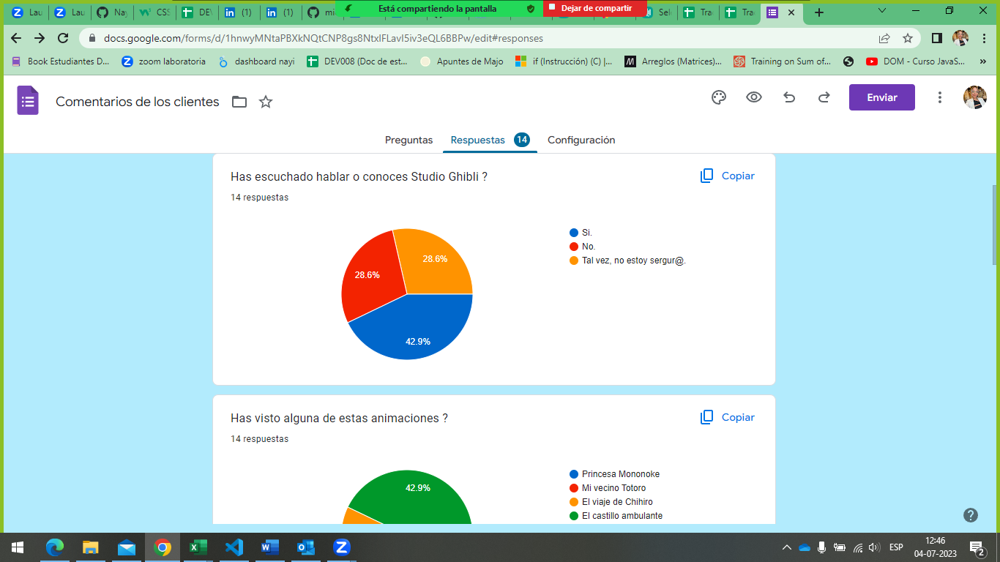
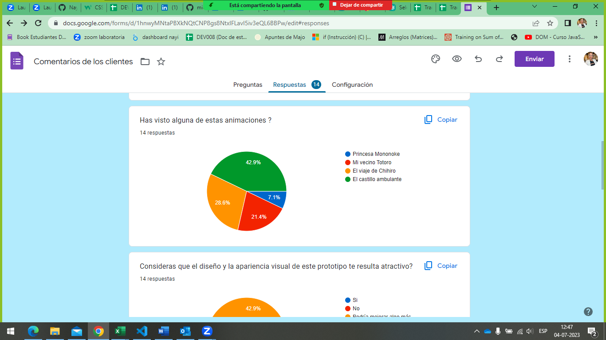
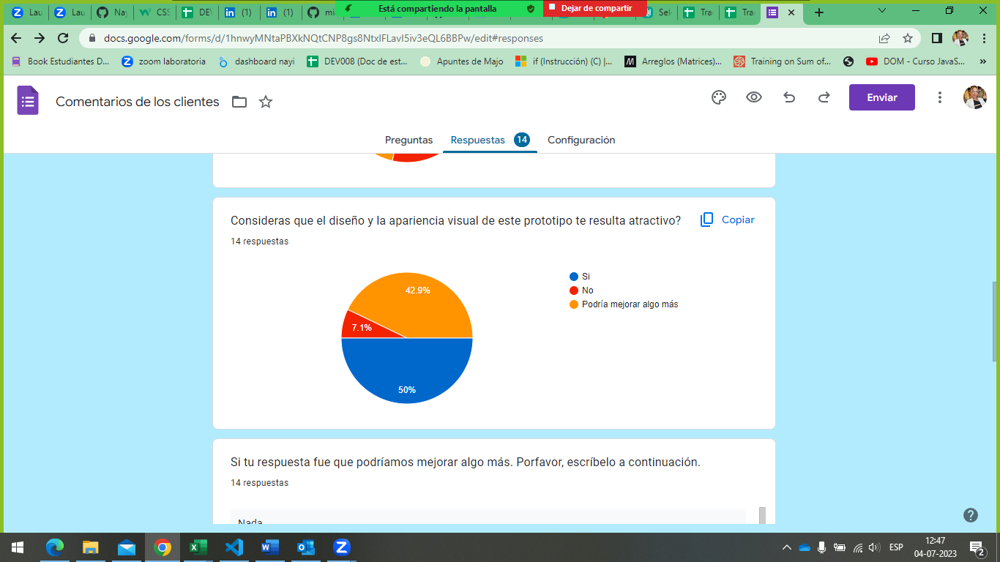
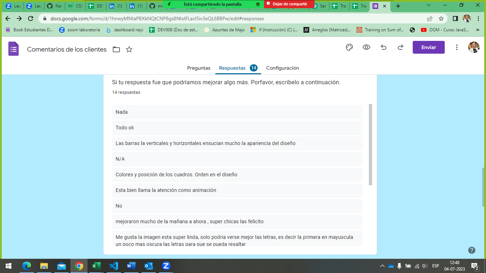
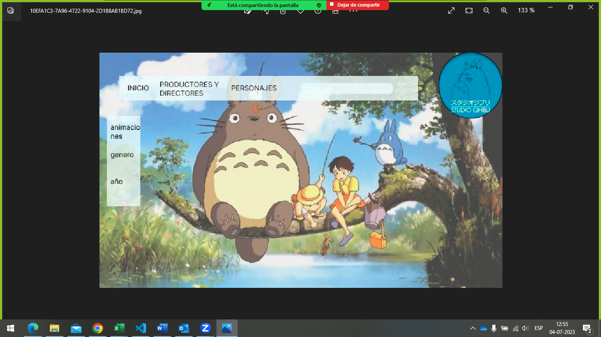

# Data Lovers

## Índice

* [1. Definición de Producto](#1-Definición-de-producto)
* [2. Historias de usuario](#2-Historias-de-usuario)
* [3. Prototipo baja fidelidad](#3-Prototipo-baja-fidelidad)
* [4. Prototipo de alta fidelidad](#4-Prototipo-de-alta-fidelidad)
* [5. Test-usabilidad](#5-Test-usabilidad)
* [6. Resultado final](#6-Resultado-final)
*
***

# Definición del producto
***
Nuestro producto está pensado en las personas que quieren obtener mas información sobre anime, mas especificamente, Studio Ghibli. 
El usuario final, puede saber o no acerca de este tema. La idea es que sea una página interactiva en donde el usuario pueda obtener informacion básica con respecto a las películas, los años de producción, y también los creadores. 
La finalidad es que el usuario pueda entrar y conseguir esta información de forma interactiva, atractiva visualmente y que pueda recibirlo de manera amigable.

# Historias de Usuario
***
Hicimos una breve encuesta para ver a qué público nos queríamos dirigir. Esto nos sirvió de base para definir lo que queríamos mostrar en nuestra página. 

Con estos datos, pudimos definir nuestro publico objeto, la temática que usaríamos y tomar también las sugerencias de los usuarios antes de comenzar el proyecto.

******

# Prototipo baja fidelidad 

Esta fue nuestra maqueta inicial

Gracias al feedback que recibimos de nuestras compañeras y coach, hicimos mejoras considerables en el diseño y maquetacion de nuestras pagina para que fuese atractiva para el usuario.

#Prototipo alta fidelidad

Luego de esto, nuestro prototipo de alta fidelidad tuvo en consideración los feedback recibidos y nos acercamos más  a lo que queríamos mostrar.

# Test usabilidad 
***
Los incovenientes que se nos presentaron fueron los siguientes:

# Resultado final
***
Acá les dejamos el link de nuestra página [ ....]
